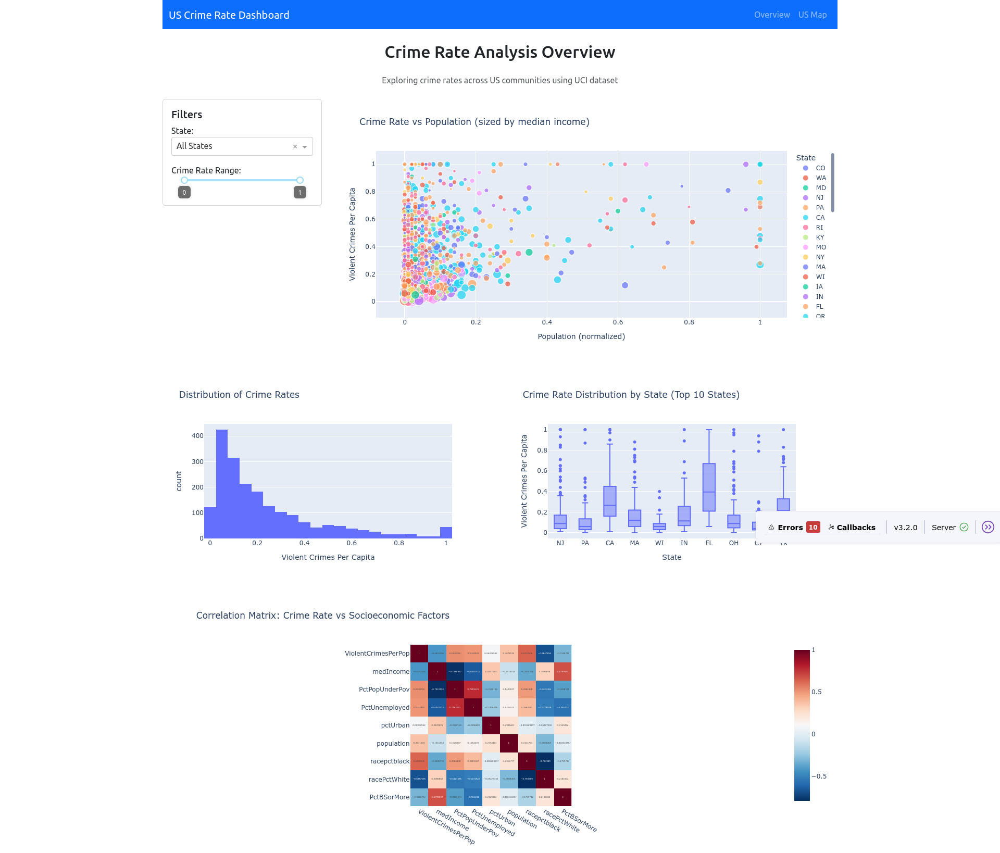
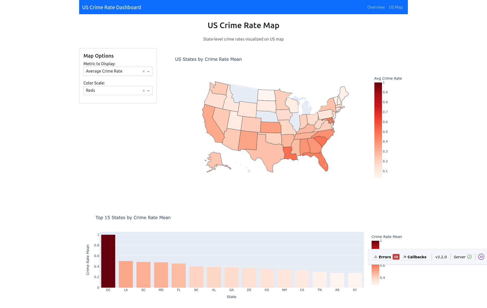

# US Communities Crime Rate Visualization Dashboard

An interactive Python Dash application for visualizing crime rates across US communities using the UCI Communities and Crime dataset.

## Overview

This project creates a comprehensive dashboard to explore violent crime rates in US communities, combining socioeconomic data from the 1990 US Census, law enforcement data from the 1990 US LEMAS survey, and crime data from the 1995 FBI UCR. The dashboard provides both community-level and state-level analysis through interactive visualizations.

## Dataset

- **Source**: [UCI Communities and Crime Dataset](https://archive.ics.uci.edu/dataset/183/communities+and+crime)
- **Size**: 1,994 communities across the United States
- **Features**: 128 attributes including demographics, socioeconomics, and law enforcement data
- **Target Variable**: Violent crimes per capita (calculated from murder, rape, robbery, and assault)

## Screenshots

### Overview Dashboard


### US Map Visualization


## Features

### 📊 Overview Dashboard
- **Interactive Scatter Plot**: Crime rate vs population (sized by median income)
- **Crime Rate Histogram**: Distribution of violent crimes across communities
- **State Comparison Boxplot**: Crime rate distribution by state
- **Correlation Heatmap**: Relationships between crime and socioeconomic factors
- **Dynamic Filtering**: Filter by state and crime rate range

### 🗺️ US Map Visualization
- **Choropleth Map**: State-level crime rates with color-coded density
- **Configurable Metrics**: 
  - Average crime rate per state
  - Median crime rate per state
  - Number of communities per state
- **Multiple Color Scales**: Reds, Blues, Viridis, Plasma
- **State Rankings**: Bar chart showing top 15 states by selected metric

### 🎛️ Interactive Controls
- State selection dropdown with proper abbreviations
- Crime rate range slider
- Metric selection for map visualization
- Color scale customization

## Installation and Setup

### Prerequisites
- Python 3.7+
- Virtual environment (recommended)

### Installation Steps

1. **Clone or download the project files**
```bash
# Ensure you have the following files:
# - crime_dashboard_with_map.py
# - communities_crime.data
# - communities_crime.names
```

2. **Create and activate virtual environment**
```bash
python3 -m venv crime_dashboard_env
source crime_dashboard_env/bin/activate  # On Windows: crime_dashboard_env\Scripts\activate
```

3. **Install required packages**
```bash
pip install pandas plotly dash dash-bootstrap-components
```

4. **Download the dataset** (if not already present)
```bash
wget -O communities_crime.data "https://archive.ics.uci.edu/ml/machine-learning-databases/communities/communities.data"
wget -O communities_crime.names "https://archive.ics.uci.edu/ml/machine-learning-databases/communities/communities.names"
```

## Usage

1. **Start the application**
```bash
source crime_dashboard_env/bin/activate
python crime_dashboard_with_map.py
```

2. **Access the dashboard**
   - Open your web browser and navigate to `http://localhost:8050/`
   - Use the navigation bar to switch between Overview and US Map pages

3. **Explore the data**
   - **Overview Page**: Analyze community-level patterns and relationships
   - **US Map Page**: Examine state-level crime rate distributions
   - Use interactive filters and controls to focus on specific regions or ranges

## Key Insights

The dashboard reveals several important patterns:

- **Geographic Variation**: Significant differences in crime rates across states
- **Socioeconomic Correlations**: Strong relationships between crime rates and factors like:
  - Poverty rates
  - Education levels
  - Urban vs rural characteristics
  - Income inequality
- **Population Density Effects**: Urban areas tend to show different crime patterns
- **State-Level Patterns**: Clear clustering of high and low crime rate states

## Technical Details

### Dependencies
- **pandas**: Data manipulation and analysis
- **plotly**: Interactive visualizations
- **dash**: Web application framework
- **dash-bootstrap-components**: UI components and styling
- **numpy**: Numerical computations

### Data Processing
- Handles missing values appropriately
- Maps state FIPS codes to standard abbreviations
- Normalizes data for consistent visualization
- Aggregates community-level data to state level for map visualization

### Architecture
- Multi-page Dash application with URL routing
- Callback-driven interactivity
- Bootstrap-based responsive design
- Modular code structure for maintainability

## File Structure

```
├── crime_dashboard_with_map.py    # Main application file
├── communities_crime.data         # UCI dataset (raw data)
├── communities_crime.names        # Dataset documentation
├── crime_dashboard_env/           # Virtual environment
└── README.md                      # This file
```

## Customization

The dashboard can be easily extended with:
- Additional visualization types
- More filtering options
- Export functionality
- Time-series analysis (if temporal data available)
- Machine learning predictions
- Comparison with other datasets

## Data Sources and Credits

- **Dataset**: UCI Machine Learning Repository - Communities and Crime
- **Original Creator**: Michael Redmond, La Salle University
- **Data Sources**: 1990 US Census, 1995 FBI UCR, 1990 US LEMAS Survey
- **Visualization**: Built with Plotly and Dash frameworks

## License

This project is for educational and research purposes. Please refer to the UCI dataset's original license and terms of use.

## Contributing

Feel free to submit issues, feature requests, or pull requests to improve the dashboard's functionality and visualizations.